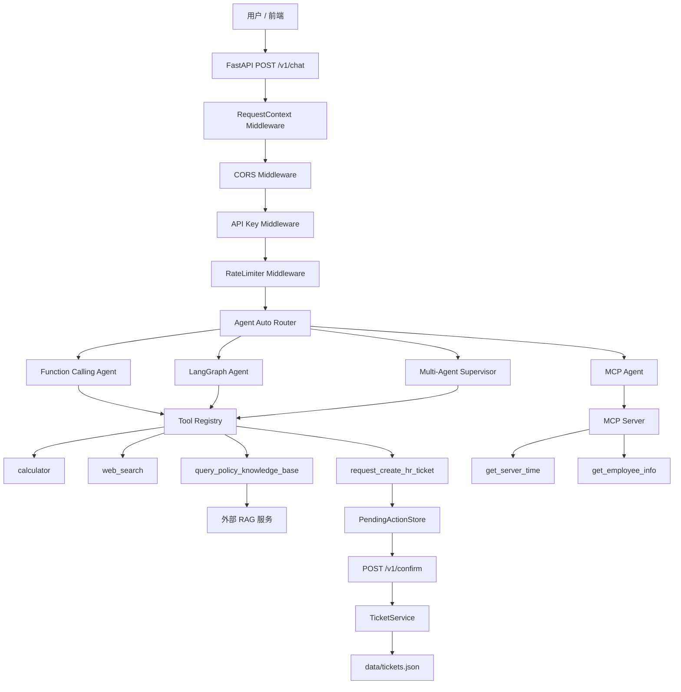
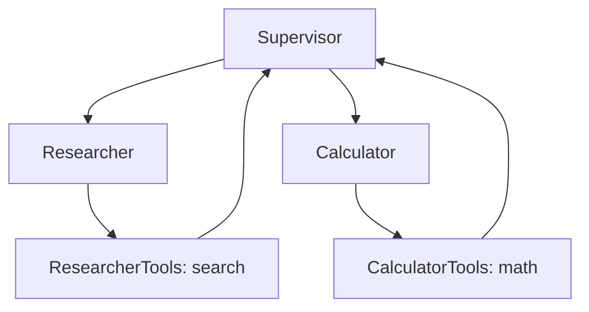
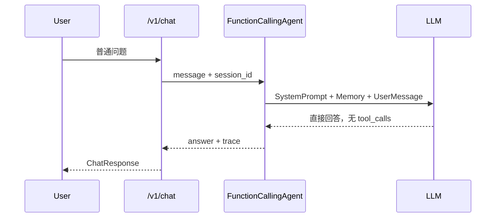
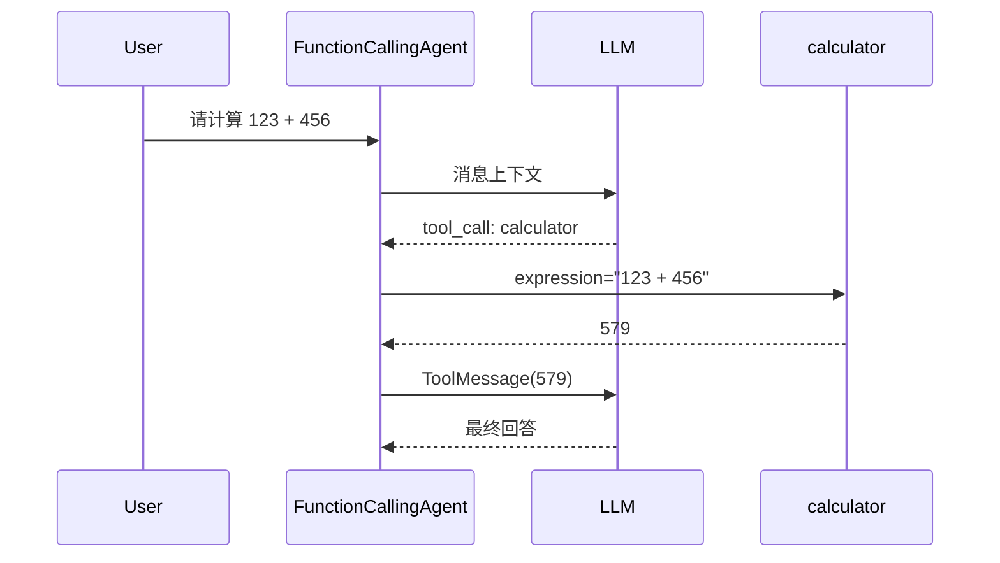
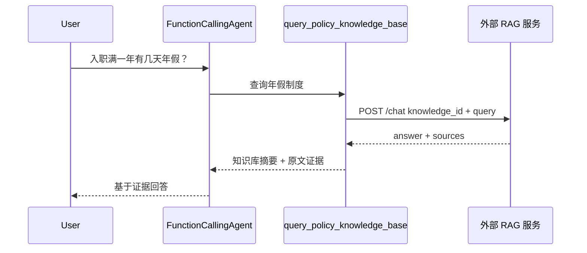
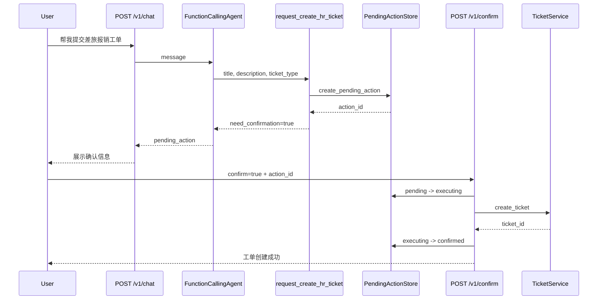
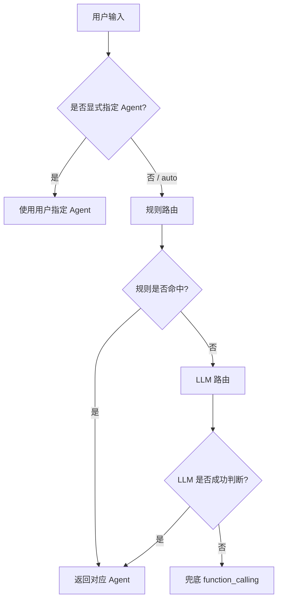

# 企业级 HR 多智能体 Agent 系统

> 基于 FastAPI + LangChain + LangGraph + MCP 的企业级 HR Agent 后端系统。  
> 项目围绕企业 HR 场景构建，支持制度知识库 RAG 问答、HR 工单 Human-in-the-loop 确认流、工具调用、自动路由、Prompt 版本管理、记忆系统、API 鉴权、限流、请求链路追踪与自动化评测。

---

## 1. 项目简介

本项目是一个面向企业 HR 场景的多智能体 Agent 系统，核心目标不是简单聊天，而是将企业内常见的 **制度查询、报销咨询、休假申请、HR 工单创建、实时信息检索、计算任务和跨系统工具调用** 统一封装为可评测、可追踪、可扩展的 Agent 后端服务。

系统支持四类 Agent：

| Agent 类型 | 作用定位 | 当前用途 |
|---|---|---|
| Function Calling Agent | 主业务 Agent | 承载 RAG 制度问答、HR 工单、计算、搜索、安全拒答等核心链路 |
| LangGraph Agent | 图结构 Agent | 用于验证 agent/tools 节点循环、工具事件记录和执行 Profile |
| Multi-Agent Supervisor | 主管-员工模式 | 通过 Researcher / Calculator 分工处理搜索和计算类任务 |
| MCP Agent | 外部工具协议接入 | 通过 MCP 协议连接企业内网工具，如服务器时间、员工信息查询 |

当前项目的主验收对象是 **Function Calling Agent**，因为它承担了最完整的企业 HR 业务链路，包括：

- 企业制度 / HR 政策 RAG 查询
- HR 工单创建请求
- Human-in-the-loop 用户确认
- 安全计算工具
- 实时搜索工具
- 工具调用 trace
- 自动化评测

---

## 2. 核心功能

### 2.1 企业制度 RAG 问答

当用户询问年假、差旅报销、绩效考核、离职流程、试用期、产假等制度问题时，系统会调用：

```text
query_policy_knowledge_base
```

该工具通过 HTTP 调用外部 RAG 服务，返回知识库答案摘要和原文证据，Agent 再基于证据生成回答。

典型问题：

```text
入职满一年有几天年假？
出差住宿费用的报销标准是多少？
公司绩效考核是每季度还是每年？
员工离职需要提前多少天申请？
```

---

### 2.2 HR 工单 Human-in-the-loop 确认流

当用户要求申请年假、提交报销、咨询 HR 问题或创建工单时，系统不会让 LLM 直接执行写操作，而是进入确认流。

流程：

```text
用户表达工单意图
↓
Agent 调用 request_create_hr_ticket
↓
生成 PendingAction
↓
接口返回 need_confirmation=true
↓
用户确认
↓
POST /v1/confirm
↓
后端真正创建 HR 工单
```

这个设计用于避免 LLM 误解用户意图后直接执行高风险操作。

---

### 2.3 安全数学计算

系统提供 `calculator` 工具，用 AST 实现安全数学表达式求值，替代危险的 `eval()`。

支持：

- 加减乘除
- 幂运算
- 取模
- 整除
- 括号表达式
- 一元正负号

并限制：

- 表达式长度
- AST 节点数量
- 递归深度
- 数字大小
- 幂指数大小
- 结果规模
- 禁止函数调用、变量访问、属性访问、容器对象等非数学表达式

---

### 2.4 增强型 Web Search

`web_search` 工具基于 DuckDuckGo Search，并增加了：

- query rewrite
- fallback 查询
- 去掉过窄年份
- 中英文关键词互补
- 薪资、云服务价格、汇率等场景的专用关键词
- 结构化搜索输出
- 搜索失败时明确禁止编造

输出结构示例：

```text
【搜索状态】
success=true
provider=duckduckgo
original_query=...
queries_tried=[...]

【高相关搜索结果】
1. 标题：...
   命中查询：...
   URL：...
   摘要：...

【回答要求】
请只基于以上搜索结果回答。
如果搜索结果不足以完成计算、比较或调研，请明确说明缺口，不要编造。
```

---

### 2.5 自动路由

系统支持 `agent_type=auto`，由自动路由器决定使用哪个 Agent。

路由策略为三层漏斗：

```text
规则路由
↓
LLM 路由
↓
兜底 function_calling
```

规则示例：

| 用户意图 | 路由结果 |
|---|---|
| 年假、报销、制度、员工手册、HR 工单 | function_calling |
| 先搜索再计算、调研然后总结 | multi_agent |
| 员工信息、工号、内网、服务器时间 | mcp |
| 复杂分析类问题 | langgraph |
| 纯计算 | function_calling |

---

### 2.6 Prompt 版本管理

Prompt 不再硬编码，而是由 `PromptManager` 从 `prompts/` 目录加载。

支持：

- prompt 文件化管理
- 多版本管理
- 自动选择最新版本
- 指定版本加载
- 热加载
- 使用统计
- 变量插值

目录结构示例：

```text
prompts/
├── system/
│   ├── v1.txt
│   └── v2.txt
├── supervisor/
│   └── v1.txt
└── router/
    └── v1.txt
```

---

### 2.7 会话记忆与长期记忆

系统包含两层记忆：

| 记忆类型 | 说明 |
|---|---|
| 短期记忆 | 保存当前 session 最近消息，超过阈值后自动压缩 |
| 长期记忆 | 基于 Elasticsearch + BGE 向量模型进行语义召回 |

长期记忆采用懒加载设计，避免服务启动时因为 ES 未启动或 BGE 模型路径错误导致整个 FastAPI 服务崩溃。

---

### 2.8 服务级安全与可观测性

系统不是纯 Demo，还加入了基础生产治理能力：

| 能力 | 说明 |
|---|---|
| API Key 鉴权 | 所有 `/v1/*` 接口需要 `X-API-Key` |
| 滑动窗口限流 | 全局限流 + 单 API Key 限流 |
| Request ID | 每个请求注入 `X-Request-ID`，便于链路追踪 |
| 全局异常处理 | 统一返回错误结构和 request_id |
| 工具调用统计 | 记录工具调用次数、成功率、平均耗时 |
| Prompt 使用统计 | 记录 prompt 加载和使用情况 |
| 健康检查 | `/health` 返回模型、工具、Prompt、session 等状态 |

---

## 3. 系统架构



---

## 4. Agent 架构说明

### 4.1 Function Calling Agent

Function Calling Agent 是当前系统的主业务 Agent。

核心循环：

```text
用户输入
↓
加载 system/v2 Prompt
↓
LLM 判断是否需要工具
↓
产生 tool_calls
↓
后端执行真实工具
↓
ToolMessage 写入记忆
↓
LLM 基于工具结果生成最终回答
```

它同时记录 ReAct Trace：

```text
Thought：模型文本推理
Action：调用了什么工具，参数是什么
Observation：工具返回了什么
Final Answer：最终回答
```

适合场景：

- HR 制度问答
- RAG 查询
- HR 工单创建
- Human-in-the-loop
- 安全拒答
- 计算
- 搜索
- 面试展示工具调用链路

---

### 4.2 LangGraph Agent

LangGraph Agent 使用图结构编排：

```text
START
↓
agent 节点
↓
tools 节点
↓
agent 节点
↓
结束
```

它记录：

- 每个节点耗时
- agent 调用次数
- tools 节点调用次数
- 工具返回事件 `tool_events`

适合展示：

- LangGraph 图结构执行
- 节点级 Profile
- 工具节点事件追踪

---

### 4.3 Multi-Agent Supervisor

Multi-Agent 采用主管-员工模式：



角色分工：

| 角色 | 工具 |
|---|---|
| Researcher | 只绑定 search 工具 |
| Calculator | 只绑定 math 工具 |
| Supervisor | 决定下一步派给谁，或 FINISH |

这样可以避免 Calculator 拥有 web_search 工具后产生选择混乱。

---

### 4.4 MCP Agent

MCP Agent 通过 `MultiServerMCPClient` 连接外部 MCP Server：

```text
MCPAgent
↓
MultiServerMCPClient
↓
mcp_servers/tools_server.py
↓
get_server_time / get_employee_info
```

当前 MCP Server 暴露两个工具：

| 工具 | 功能 |
|---|---|
| get_server_time | 获取企业内网服务器当前时间 |
| get_employee_info | 根据工号查询员工信息 |

MCP 连接使用 `async with` 管理，确保异步连接正确关闭，避免子进程泄漏。

---

## 5. 核心数据流

### 5.1 普通问答数据流



---

### 5.2 计算任务数据流



---

### 5.3 RAG 制度问答数据流



---

### 5.4 HR 工单 Human-in-the-loop 数据流



---

### 5.5 自动路由数据流



---

## 6. 工具系统

### 6.1 工具注册中心

工具统一通过 `ToolRegistry` 管理，支持：

- 注册工具
- 按标签筛选工具
- 动态启用 / 禁用工具
- 工具调用统计
- 成功率统计
- 平均耗时统计

当前注册工具：

| 工具 | 标签 | 说明 |
|---|---|---|
| calculator | math, calculation | AST 安全数学计算 |
| web_search | search, information_retrieval | 增强型实时搜索 |
| query_policy_knowledge_base | rag, policy, knowledge_base, hr | 企业 HR 制度 RAG 查询 |
| request_create_hr_ticket | ticket, hr, hitl | HR 工单待确认操作 |

---

### 6.2 工具选择边界

| 场景 | 工具 |
|---|---|
| 需要精确计算 | calculator |
| 最新信息 / 新闻 / 股票 / 市场数据 | web_search |
| 企业制度 / 员工手册 / HR 政策 | query_policy_knowledge_base |
| HR 工单 / 申请 / 报销 / 请假 | request_create_hr_ticket |
| 企业内网工具 | MCP tools |

---

## 7. API 接口

服务默认运行在：

```text
http://localhost:8000
```

### 7.1 健康检查

```http
GET /health
```

返回内容包括：

- 服务状态
- 版本
- LLM 模型
- LLM 是否配置
- 鉴权是否启用
- 活跃 session 数
- 已注册工具
- 已加载 Prompt

---

### 7.2 对话接口

```http
POST /v1/chat
X-API-Key: dev-key-123
Content-Type: application/json
```

请求体：

```json
{
  "message": "入职满一年有几天年假？",
  "session_id": "demo-session-001",
  "agent_type": "auto"
}
```

`agent_type` 可选：

```text
auto
function_calling
langgraph
multi_agent
mcp
```

响应示例：

```json
{
  "response_code": 200,
  "response_msg": "success",
  "session_id": "demo-session-001",
  "answer": "根据公司员工手册...",
  "agent_type": "function_calling",
  "tool_calls": [
    {
      "tool_name": "query_policy_knowledge_base",
      "tool_input": {
        "query": "入职满一年员工享有多少天年假"
      },
      "tool_output": "【知识库答案摘要】..."
    }
  ],
  "need_confirmation": false,
  "pending_action": null
}
```

---

### 7.3 确认接口

```http
POST /v1/confirm
X-API-Key: dev-key-123
Content-Type: application/json
```

请求体：

```json
{
  "session_id": "demo-session-001",
  "action_id": "pending-action-id",
  "confirm": true
}
```

确认后，系统才真正创建 HR 工单。

---

### 7.4 工具统计

```http
GET /v1/stats/tools
X-API-Key: dev-key-123
```

---

### 7.5 工单列表

```http
GET /v1/tickets?session_id=demo-session-001
X-API-Key: dev-key-123
```

---

### 7.6 Prompt 热加载

```http
POST /v1/prompts/reload?name=system&version=v2
X-API-Key: dev-key-123
```

---

### 7.7 Prompt 版本查看

```http
GET /v1/prompts/versions?name=system
X-API-Key: dev-key-123
```

---

## 8. 配置说明

核心配置文件为：

```text
config.yaml
```

示例：

```yaml
app:
  host: "0.0.0.0"
  port: 8000
  debug: true

llm:
  base_url: "https://dashscope.aliyuncs.com/compatible-mode/v1"
  model: "qwen-plus"
  temperature: 0.1
  max_tokens: 4096
  streaming: true

agent:
  max_iterations: 6
  max_supervisor_rounds: 5
  tool_timeout: 30
  tool_retry: true
  tool_retry_times: 2

memory:
  short_term_max_messages: 20
  es_host: "http://localhost:9200"
  bge_model_path: "D:/ai_models/bge-small-zh-v1.5"
  long_term_top_k: 3

tools:
  search_max_results: 5
  rag_api_url: "http://localhost:6006/chat"
  rag_knowledge_id: 1

mcp:
  server_script: "mcp_servers/tools_server.py"
  transport: "stdio"

logging:
  level: "INFO"
  file: "logs/agent.log"
```

敏感信息放在 `.env`：

```env
DASHSCOPE_API_KEY=sk-your-key
AGENT_API_KEYS=dev-key-123
ENABLE_AUTH=true
```

---

## 9. 本地启动

### 9.1 安装依赖

推荐 Python 3.11。

```bash
pip install -r requirements.txt
```

---

### 9.2 配置环境变量

新建 `.env`：

```env
DASHSCOPE_API_KEY=你的 DashScope API Key
AGENT_API_KEYS=dev-key-123
ENABLE_AUTH=true
```

---

### 9.3 启动外部 RAG 服务

如果要测试 HR 制度问答，需要先启动你的 RAG 项目，并保证接口可访问：

```text
http://localhost:6006/chat
```

---

### 9.4 启动 Agent 服务

```bash
uvicorn app.api.main:app --reload --host 0.0.0.0 --port 8000
```

或者：

```bash
python -m app.api.main
```

---

### 9.5 访问 Swagger

```text
http://localhost:8000/docs
```

Swagger 已支持 `X-API-Key` Authorize 按钮。

---

## 10. 使用示例

### 10.1 制度问答

```bash
curl -X POST "http://localhost:8000/v1/chat" \
  -H "Content-Type: application/json" \
  -H "X-API-Key: dev-key-123" \
  -d '{
    "message": "入职满一年有几天年假？请根据公司制度回答",
    "session_id": "demo-001",
    "agent_type": "function_calling"
  }'
```

---

### 10.2 创建 HR 工单

```bash
curl -X POST "http://localhost:8000/v1/chat" \
  -H "Content-Type: application/json" \
  -H "X-API-Key: dev-key-123" \
  -d '{
    "message": "帮我提交一个差旅报销工单，上次出差花了1200元住宿费",
    "session_id": "demo-002",
    "agent_type": "function_calling"
  }'
```

返回中会包含：

```json
{
  "need_confirmation": true,
  "pending_action": {
    "action_id": "...",
    "action_type": "create_hr_ticket",
    "tool_name": "request_create_hr_ticket"
  }
}
```

然后确认：

```bash
curl -X POST "http://localhost:8000/v1/confirm" \
  -H "Content-Type: application/json" \
  -H "X-API-Key: dev-key-123" \
  -d '{
    "session_id": "demo-002",
    "action_id": "上一步返回的 action_id",
    "confirm": true
  }'
```

---

### 10.3 MCP 工具查询

```bash
curl -X POST "http://localhost:8000/v1/chat" \
  -H "Content-Type: application/json" \
  -H "X-API-Key: dev-key-123" \
  -d '{
    "message": "帮我查一下工号 E1001 的员工信息",
    "session_id": "demo-mcp",
    "agent_type": "mcp"
  }'
```

---

## 11. 自动化评测

项目提供自动化评测脚本：

```text
scripts/eval_agent.py
```

评测分为三层：

| 层级 | 说明 |
|---|---|
| 流程评测 | 工具是否调对、是否需要确认、是否拒答、延迟 |
| 确定性质量评测 | 关键词、禁止词、RAG 错误、ticket_type、动态日期 |
| LLM-as-judge | 可选，评估 correctness / completeness / faithfulness / safety / clarity |

---

### 11.1 常用评测命令

全量 Function Agent 评测：

```bash
python scripts/eval_agent.py \
  --agent function_calling \
  --url http://localhost:8000 \
  --key dev-key-123 \
  --verbose
```

D 类 RAG judge：

```bash
$env:PYTHONPATH = (Get-Location).Path
python scripts/eval_agent.py \
  --agent function_calling \
  --url http://localhost:8000 \
  --key dev-key-123 \
  --category D \
  --judge \
  --verbose
```

F 类搜索 judge：

```bash
$env:PYTHONPATH = (Get-Location).Path
python scripts/eval_agent.py \
  --agent function_calling \
  --url http://localhost:8000 \
  --key dev-key-123 \
  --category F \
  --judge \
  --verbose
```

E 类工单专项：

```bash
python scripts/eval_agent.py \
  --agent function_calling \
  --url http://localhost:8000 \
  --key dev-key-123 \
  --category E \
  --verbose
```

H 类安全拒答专项：

```bash
python scripts/eval_agent.py \
  --agent function_calling \
  --url http://localhost:8000 \
  --key dev-key-123 \
  --category H \
  --verbose
```

---

## 12. 最终评测结果

### 12.1 Function Calling Agent 全量回归测试

| 指标 | 结果 |
|---|---:|
| total | 29 |
| passed | 28 |
| overall_accuracy | 96.55% |
| workflow_accuracy | 96.55% |
| deterministic_quality_accuracy | 100% |
| tool_accuracy | 95.24% |
| no_tool_accuracy | 100% |
| confirmation_accuracy | 100% |
| refusal_accuracy | 100% |
| rag_quality_accuracy | 100% |
| ticket_type_accuracy | 100% |
| tool_input_keyword_accuracy | 100% |
| dynamic_date_accuracy | 100% |

说明：

- 主业务链路基本稳定。
- 唯一未自动通过的 case 为 H1 无依据制度查询中的工具调用断言未命中，但最终回答已正确拒绝编造制度。
- 对简历项目和面试展示而言，已达到 V1 验收水平。

---

### 12.2 D 类 RAG 制度问答 Judge 评测

| 指标 | 结果 |
|---|---:|
| total | 6 |
| passed | 6 |
| overall_accuracy | 100% |
| tool_accuracy | 100% |
| rag_quality_accuracy | 100% |
| judge_accuracy | 100% |

覆盖场景：

- 年假政策
- 差旅报销标准
- 绩效考核周期
- 离职流程
- 试用期规定
- 产假政策

说明：

- 所有制度问题均调用 RAG 工具。
- 回答基于知识库证据。
- LLM-as-judge 维度全部通过。

---

### 12.3 F 类搜索多步骤 Judge 评测

| 指标 | 结果 |
|---|---:|
| total | 3 |
| passed | 2 |
| overall_accuracy | 66.67% |
| workflow_accuracy | 100% |
| tool_accuracy | 100% |
| judge_accuracy | 66.67% |

覆盖场景：

- 搜索后计算
- 查询后比较
- 调研后汇总

说明：

- 工具调用链路全部通过。
- 系统在搜索结果不足时没有编造数据，而是说明数据缺口。
- 失败项主要来自多对象比较任务中搜索规划不足，例如只搜索 Python 薪资但未搜索 Java 薪资。
- 后续可通过专用汇率工具、薪资数据源、多对象搜索规划或 Tavily / Brave Search API 优化。

---

## 13. 已知边界与后续优化

### 13.1 Web Search 召回仍有限

当前 `web_search` 基于 DuckDuckGo Search，虽然已经支持 query rewrite 和 fallback，但仍存在：

- 实时汇率难以直接提取数值
- 股价、汇率、薪资等结构化数据不稳定
- 多对象比较任务依赖 Agent 搜索规划
- 搜索摘要不一定包含可直接计算的数据

后续优化：

```text
1. 增加 exchange_rate 专用工具
2. 增加 finance_quote 专用工具
3. 接入 Tavily / Brave Search API
4. 将 MCP Search Server 作为 Search Provider
5. 强化多对象比较任务的搜索规划
```

---

### 13.2 LangGraph / Multi-Agent / MCP 需要专项评测

当前自动化评测主要围绕 Function Calling Agent，因为它承载主业务链路。

后续可补充：

| Agent | 建议专项测试 |
|---|---|
| LangGraph | B/D/E 小类，验证图结构执行、tool_events 和 pending_action |
| Multi-Agent | F 类搜索 + 计算协作任务 |
| MCP | M 类企业内网工具测试，如服务器时间、员工信息、不存在员工 |

---

### 13.3 PendingAction 当前为内存存储

当前 `PendingActionStore` 是内存版，适合本地开发和面试展示。

生产优化：

```text
1. Redis 存储 pending action
2. 增加 TTL 自动过期
3. 多实例共享状态
4. 幂等确认机制
5. 操作审计日志
```

---

### 13.4 TicketService 当前为 JSON 文件持久化

当前工单服务使用内存 + JSON 文件存储。

生产优化：

```text
1. 替换为 MySQL / PostgreSQL
2. 增加工单状态流转
3. 增加创建人 / 审批人 / 处理人
4. 增加附件和备注
5. 接入真实 OA / HRIS 系统
```

---

### 13.5 长期记忆依赖 ES + 本地 BGE 模型

当前长期记忆为可选能力，已经做了懒加载和失败降级。

生产优化：

```text
1. 增加 ES 健康检查
2. 模型路径环境变量化
3. 使用统一向量数据库
4. 增加记忆写入策略
5. 增加隐私和数据清理机制
```

---

## 14. 项目亮点

### 14.1 不只是 Prompt Demo

项目不是靠 Prompt 硬凑逻辑，而是把 LLM 放进受控的业务执行框架：

```text
Prompt 约束决策
Tool Calling 执行能力
PendingAction 保护写操作
RAG 保证制度回答有证据
Eval 验证系统行为
API 中间件保证服务安全
```

---

### 14.2 Human-in-the-loop 设计

LLM 不能直接创建 HR 工单，只能生成待确认操作。用户确认后，后端才真正创建工单。

这是企业 Agent 处理写操作的重要安全边界。

---

### 14.3 可评测

项目不仅实现功能，还提供自动化评测脚本，覆盖：

- 普通问答
- 计算
- 搜索
- RAG
- HR 工单
- 多步骤任务
- 反例
- 安全拒答
- 动态日期
- LLM-as-judge

---

### 14.4 工具治理

通过 Tool Registry 实现：

- 工具统一注册
- 按标签筛选
- 不同 Agent 绑定不同工具集
- 工具调用统计
- 工具成功率监控

---

### 14.5 服务化工程能力

系统加入了：

- API Key 鉴权
- 滑动窗口限流
- request_id 链路追踪
- 全局异常处理
- 健康检查
- Swagger API Key 支持
- 日志文件滚动

这些是从 Demo 向工程化系统演进的重要能力。

---

## 15. 推荐目录结构

```text
agent/
├── app/
│   ├── agents/
│   │   ├── function_calling_agent.py
│   │   ├── langgraph_agent.py
│   │   ├── multi_agent.py
│   │   └── mcp_agent.py
│   ├── api/
│   │   ├── main.py
│   │   ├── schemas.py
│   │   ├── routers/
│   │   │   └── agent_router.py
│   │   └── middleware/
│   │       ├── auth.py
│   │       ├── rate_limiter.py
│   │       └── request_context.py
│   ├── core/
│   │   ├── auto_router.py
│   │   ├── config.py
│   │   ├── llm_client.py
│   │   ├── logger.py
│   │   └── prompt_manager.py
│   ├── graph/
│   │   └── state.py
│   ├── memory/
│   │   ├── manager.py
│   │   └── long_term.py
│   ├── services/
│   │   ├── pending_action_store.py
│   │   └── ticket_service.py
│   └── tools/
│       ├── __init__.py
│       ├── calculator.py
│       ├── search.py
│       ├── rag_search.py
│       ├── registry.py
│       └── ticket.py
├── mcp_servers/
│   └── tools_server.py
├── prompts/
│   ├── system/
│   │   ├── v1.txt
│   │   └── v2.txt
│   ├── supervisor/
│   │   └── v1.txt
│   └── router/
│       └── v1.txt
├── scripts/
│   └── eval_agent.py
├── reports/
│   ├── final/
│   └── archive/
├── data/
│   └── tickets.json
├── logs/
│   └── agent.log
├── config.yaml
├── requirements.txt
└── README.md
```

---

## 16. 面试讲解版本

可以用下面这段介绍项目：

> 我做的是一个企业级 HR Agent 后端系统，不是单纯聊天机器人。系统支持 Function Calling、LangGraph、Multi-Agent 和 MCP 四类 Agent，其中 Function Calling Agent 是主业务链路，负责 HR 制度 RAG 问答、HR 工单创建、Human-in-the-loop 确认流、计算和搜索工具调用。  
> 
> 企业写操作不允许 LLM 直接执行，所以我设计了 PendingAction 状态机：用户请求创建工单时，Agent 只生成 pending_action，接口返回 need_confirmation，用户确认后 `/v1/confirm` 才真正调用 TicketService 创建工单。  
> 
> 制度问答通过 RAG 工具接入外部知识库，回答必须基于知识库证据；计算通过 AST 安全计算工具；搜索工具做了 query rewrite 和 fallback 查询。系统还有工具注册中心、Prompt 版本管理、短期/长期记忆、API Key 鉴权、滑动窗口限流、request_id 链路追踪和自动化评测。  
> 
> 最终 Function Calling Agent 全量评测 29 条通过 28 条，overall_accuracy 为 96.55%；D 类 RAG 制度问答 judge 6/6 通过；HR 工单确认流、拒答、动态日期、ticket_type、工具参数关键词等关键指标均达到 100%。

---

## 17. 当前项目状态

当前版本适合用于：

```text
1. 简历项目展示
2. 面试讲解
3. Agent 工程能力展示
4. Function Calling + RAG + HITL 业务闭环展示
5. 多 Agent 架构扩展展示
```

尚不建议直接作为生产系统上线，生产化还需要：

```text
1. Redis / 数据库存储 PendingAction
2. 真实 HRIS / OA 系统集成
3. 更稳定的搜索和金融数据 API
4. 更完善的权限系统
5. 更完整的 LangGraph / Multi-Agent / MCP 专项评测
6. CI/CD 与自动化测试流水线
```

---

## 18. 一句话总结

这个项目的核心不是“写了几个 Prompt”，而是：

> 用 Prompt 约束 LLM 决策，用 Tool Calling 执行业务能力，用 PendingAction 保护高风险写操作，用 RAG 保证制度问答有证据，用自动化评测验证 Agent 行为，用 FastAPI 中间件补齐服务级安全与可观测性。

